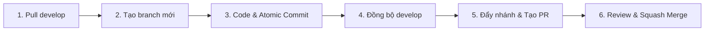

# 🏨 SE100 — Hotel Booking Platform
### Nền Tảng Đặt Phòng Khách Sạn Trực Tuyến

<p align="left">
  
  
  
  
  
  
  
</p>

---

### 📋 Thông Tin Dự Án

| Hạng mục | Chi tiết |
| :--- | :--- |
| **Môn học** | SE100 |
| **Chủ dự án** | **Thinh Phat Ho** ([@miyxotkem](https://github.com/miyxotkem)) |
| **Kiến trúc** | Monorepo (NestJS Backend + Vue 3 Frontend + PostgreSQL 16) |
| **Kho lưu trữ** | [miyxotkem/SE100_DatPhongKhachSan](https://github.com/miyxotkem/SE100_DatPhongKhachSan) |

---

## 📑 Mục Lục

1. [Kiến Trúc Công Nghệ (Tech Stack)](#1-kiến-trúc-công-nghệ-tech-stack)
2. [Cấu Trúc Thư Mục Monorepo](#2-cấu-trúc-thư-mục-monorepo)
3. [Hướng Dẫn Cài Đặt & Khởi Chạy (Local Development)](#3-hướng-dẫn-cài-đặt--khởi-chạy-local-development)
4. [Quy Chuẩn Làm Việc Git & GitHub](#4-quy-chuẩn-làm-việc-git--github)
   - [4.1. Ba Điều Cấm](#41-ba-điều-cấm)
   - [4.2. Quy Tắc Đặt Tên Nhánh](#42-quy-tắc-đặt-tên-nhánh)
   - [4.3. Quy Chuẩn Commit Message](#43-quy-chuẩn-commit-message)
   - [4.4. Quy Trình 6 Bước Làm Việc Hằng Ngày](#44-quy-trình-6-bước-làm-việc-hằng-ngày)
   - [4.5. Hướng Dẫn Xử Lý Xung Đột (Conflict)](#45-hướng-dẫn-xử-lý-xung-đột-conflict)
   - [4.6. Phân Vùng Quyền Hạn Trong Monorepo](#46-phân-vùng-quyền-hạn-trong-monorepo)

---

## 1. Kiến Trúc Công Nghệ (Tech Stack)

| Lĩnh vực | Công nghệ / Thư viện | Mô tả vai trò |
| :--- | :--- | :--- |
| **Backend** | [NestJS](https://nestjs.com/) (TypeScript) | Xây dựng RESTful API, Global Exception Filters, Transform Interceptors. |
| **Database & ORM** | [PostgreSQL 16](https://www.postgresql.org/) + [Prisma ORM](https://www.prisma.io/) | Cơ sở dữ liệu quan hệ chuẩn 3NF, quản lý schema và migrations. |
| **Authentication** | JWT, Passport-JWT, Bcrypt | Xác thực bảo mật người dùng, phân quyền truy cập. |
| **Media Storage** | [Cloudinary](https://cloudinary.com/) SDK | Lưu trữ đám mây và tối ưu hoá ảnh đại diện, ảnh phòng, ảnh khách sạn. |
| **Frontend** | [Vue 3](https://vuejs.org/) + [Vite](https://vitejs.dev/) | Giao diện hiện đại sử dụng Composition API (`<script setup lang="ts">`). |
| **Styling** | [Tailwind CSS](https://tailwindcss.com/) | Thiết kế giao diện trực quan, tối ưu hiển thị responsive đa màn hình. |
| **State & Route** | [Pinia](https://pinia.vuejs.org/) + [Vue Router 4](https://router.vuejs.org/) | Quản lý luồng trạng thái tập trung và định tuyến bảo vệ màn hình. |
| **Bản đồ** | [Mapbox GL JS](https://www.mapbox.com/) | Hiển thị toạ độ khách sạn, hỗ trợ tìm kiếm phòng theo vị trí địa lý. |
| **CI/CD & DevOps** | Docker Compose, GitHub Actions | Container hoá database môi trường local; CI tự động kiểm tra build BE/FE. |

---

## 2. Cấu Trúc Thư Mục Monorepo

```plaintext
SE100_DatPhongKhachSan/
├── .github/
│   ├── workflows/
│   │   └── ci.yml               # GitHub Actions CI tự động kiểm tra build BE & FE
│   └── pull_request_template.md # Mẫu Pull Request chuẩn dự án
├── backend/                     # Mã nguồn Backend (NestJS + Prisma)
│   ├── prisma/
│   │   └── schema.prisma        # Lược đồ CSDL chi tiết các bảng
│   └── src/
│       ├── common/              # Bộ lọc ngoại lệ, interceptor, upload Cloudinary
│       ├── modules/             # Các module nghiệp vụ (auth, hotels, rooms, bookings)
│       ├── prisma/              # PrismaService kết nối database
│       └── main.ts              # Entrypoint (CORS, ValidationPipe, Prefix api/v1)
├── frontend/                    # Mã nguồn Frontend (Vue 3 + Vite + Tailwind)
│   └── src/
│       ├── components/common/   # Các UI component tái sử dụng (BaseButton, BaseInput)
│       ├── layouts/             # Bố cục giao diện (MainLayout & BookingLayout)
│       ├── router/              # Thiết lập route và guard phân quyền
│       ├── services/            # Axios Client tích hợp Interceptor
│       └── views/               # Landing, Login, Register, Dashboard, Hotels, Booking
├── docker-compose.yml           # Cấu hình chạy PostgreSQL 16 (Port 5435)
├── .env.example                 # File mẫu cấu hình biến môi trường
├── .gitignore                   # Cấu hình bỏ qua tệp tin rác
└── README.md                    # Tài liệu hướng dẫn & quy chuẩn dự án
```

---

## 3. Hướng Dẫn Cài Đặt & Khởi Chạy (Local Development)

### 📌 Tổng quan các cổng dịch vụ (Ports)
| Dịch vụ | Cổng (Port) | Đường dẫn mặc định |
| :--- | :--- | :--- |
| **Frontend Web** | `5173` | `http://localhost:5173` |
| **Backend API** | `3000` | `http://localhost:3000/api/v1` |
| **PostgreSQL Database** | `5435` | Chạy nền qua Docker (tránh trùng cổng mặc định 5432 & 5434) |

---

### Các bước cài đặt chi tiết:

#### 🔹 Bước 1: Khởi tạo biến môi trường
Sao chép cấu hình mẫu `.env.example` sang file `.env` ở cả thư mục gốc và thư mục `backend/`:
```bash
cp .env.example .env
cp .env.example backend/.env
```

#### 🔹 Bước 2: Khởi động Database qua Docker
Đảm bảo **Docker Desktop** đã được mở, sau đó khởi chạy container PostgreSQL:
```bash
docker compose up -d
```

#### 🔹 Bước 3: Cài đặt và chạy Backend (NestJS)
Mở một cửa sổ Terminal và tiến hành cài đặt thư viện, generate Prisma schema và khởi động server:
```bash
cd backend
npm install
npx prisma generate
npx prisma migrate dev
npm run start:dev
```
> API Server sẽ sẵn sàng phục vụ tại: `http://localhost:3000/api/v1`

#### 🔹 Bước 4: Cài đặt và chạy Frontend (Vue 3)
Mở một cửa sổ Terminal riêng biệt cho Frontend:
```bash
cd frontend
npm install
npm run dev
```
> Truy cập giao diện ứng dụng tại: `http://localhost:5173`

---

## 4. Quy Chuẩn Làm Việc Git & GitHub

Nhằm đảm bảo an toàn cho mã nguồn và phòng tránh tối đa xung đột (conflict), tất cả thành viên **bắt buộc tuân thủ 100%** các quy định dưới đây.

### 4.1. Ba Điều Cấm

> [!CAUTION]
> 1. **TUYỆT ĐỐI KHÔNG** `git push` trực tiếp lên nhánh `main` hoặc `develop`. Mọi thay đổi đều phải thông qua Pull Request (PR).
> 2. **TUYỆT ĐỐI KHÔNG** commit các file nhạy cảm (`.env`), file rác của hệ điều hành, hay thư mục phụ thuộc (`node_modules/`, `dist/`).
> 3. **TUYỆT ĐỐI KHÔNG** tự ý can thiệp vào mã nguồn module của người khác khi chưa có sự thống nhất trước.

---

### 4.2. Quy Tắc Đặt Tên Nhánh

Mọi nhánh chức năng phải được tách từ nhánh **`develop`** mới nhất:

| Loại công việc | Định dạng đặt tên | Ví dụ cụ thể |
| :--- | :--- | :--- |
| **Backend Feature** | `feat/be-<tên-chức-năng>` | `feat/be-auth-jwt`, `feat/be-hotels-crud`, `feat/be-booking` |
| **Frontend Feature** | `feat/fe-<tên-chức-năng>` | `feat/fe-login-page`, `feat/fe-hotel-list`, `feat/fe-booking-flow` |
| **Sửa lỗi (Bugfix)** | `fix/be-<lỗi>` hoặc `fix/fe-<lỗi>` | `fix/fe-booking-date-picker`, `fix/be-token-expired` |
| **Tối ưu / Cấu hình** | `chore/<nội-dung>` hoặc `refactor/<nội-dung>` | `chore/update-dependencies`, `refactor/booking-service` |

---

### 4.3. Quy Chuẩn Commit Message

Sử dụng định dạng **Conventional Commits** để thể hiện rõ ràng mục đích thay đổi:

| Tiền tố | Mô tả mục đích | Ví dụ minh họa |
| :--- | :--- | :--- |
| `feat(scope)` | Bổ sung tính năng mới | `feat(auth): thêm api đăng nhập bằng jwt` |
| `fix(scope)` | Vá lỗi hệ thống | `fix(booking): sửa lỗi tính toán ngày nhận/trả phòng` |
| `style(scope)` | Căn chỉnh CSS, giao diện (không đổi logic) | `style(hotel-card): chuẩn hóa khoảng cách hiển thị giá` |
| `refactor(scope)` | Tái cấu trúc mã nguồn, dọn dẹp logic | `refactor(rooms): tối ưu truy vấn lấy danh sách phòng trống` |
| `docs(scope)` | Bổ sung, điều chỉnh tài liệu | `docs(readme): làm mới hướng dẫn và quy chuẩn dự án` |

---

### 4.4. Quy Trình 6 Bước Làm Việc Hằng Ngày

Khi bắt đầu ca làm việc hoặc triển khai tính năng mới, hãy thực hiện tuần tự:



#### 1️⃣ Bước 1: Đồng bộ nhánh `develop` mới nhất về máy
```bash
git checkout develop
git pull origin develop
```

#### 2️⃣ Bước 2: Khởi tạo nhánh mới từ `develop`
```bash
git checkout -b feat/fe-hotel-list
```

#### 3️⃣ Bước 3: Code và Commit từng phần nhỏ (Atomic Commits)
Không dồn toàn bộ công việc vào một commit lớn. Hoàn tất từng hàm/component -> Kiểm tra chạy ổn định -> Commit ngay:
```bash
git status
git add src/views/HotelListView.vue
git commit -m "feat(hotels): hoàn thiện giao diện danh sách khách sạn"
```

#### 4️⃣ Bước 4: Kéo cập nhật từ `develop` trước khi mở PR *(Rất quan trọng để tránh conflict)*
```bash
git checkout develop
git pull origin develop
git checkout feat/fe-hotel-list
git merge develop
```
* **Không xung đột:** Git sẽ tự động hợp nhất an toàn.
* **Có xung đột:** Tham khảo ngay mục [4.5](#45-hướng-dẫn-xử-lý-xung-đột-conflict) bên dưới.

#### 5️⃣ Bước 5: Đẩy nhánh lên remote và tạo Pull Request
```bash
git push -u origin feat/fe-hotel-list
```
1. Truy cập repo: [miyxotkem/SE100_DatPhongKhachSan](https://github.com/miyxotkem/SE100_DatPhongKhachSan).
2. Nhấn nút **Compare & pull request**.
3. **Lưu ý cấu hình nhánh:** `base: develop` ⬅️ `compare: feat/fe-hotel-list`.
4. Điền đầy đủ thông tin theo mẫu **Pull Request Template**.

#### 6️⃣ Bước 6: Kiểm tra CI, Review & Merge
1. Đợi GitHub Actions CI hoàn tất kiểm tra tự động (**All checks have passed**).
2. Thông báo đến Tech Lead hoặc người đánh giá phản biện.
3. Sau khi nhận được **Approve**, tiến hành **Squash and merge** vào `develop`.
4. Dọn dẹp nhánh cũ:
```bash
git branch -d feat/fe-hotel-list
```

---

### 4.5. Hướng Dẫn Xử Lý Xung Đột (Conflict)

Khi chạy `git merge develop` gặp thông báo `CONFLICT (content): Merge conflict in ...`:

1. **Giữ bình tĩnh:** Mở VS Code, các file có xung đột sẽ được đánh dấu màu cam/đỏ.
2. **Kiểm tra vùng xung đột:**
   - `Current Change`: Code trên nhánh bạn đang viết.
   - `Incoming Change`: Code mới từ `develop` do thành viên khác vừa cập nhật.
3. **Lựa chọn xử lý:** Sử dụng công cụ của VS Code (`Accept Current`, `Accept Incoming`, hoặc `Accept Both`).
4. **Nguyên tắc phối hợp:** Nếu xung đột logic của người khác, hãy trao đổi trực tiếp với tác giả đoạn code đó; tuyệt đối không tự ý xoá code của đồng đội.
5. **Hoàn tất merge:**
   ```bash
   npm run build   # Kiểm tra tính toàn vẹn cú pháp sau khi giải quyết conflict
   git add .
   git commit -m "merge: giải quyết conflict với nhánh develop"
   git push origin feat/fe-hotel-list
   ```

---

### 4.6. Phân Vùng Quyền Hạn Trong Monorepo

* **Backend Dev:** Chỉ thực hiện thay đổi trong phạm vi thư mục `backend/`.
* **Frontend Dev:** Chỉ thực hiện thay đổi trong phạm vi thư mục `frontend/`.
* **Quản lý Dependencies:** Khi cài thêm gói NPM mới, phải thông báo lên nhóm để các thành viên khác chạy lại `npm install` khi đồng bộ code.
* **Cấu hình dùng chung:** Mọi thay đổi ở root (`docker-compose.yml`, `.github/`, `.env.example`) phải được thống nhất qua **Tech Lead**.
